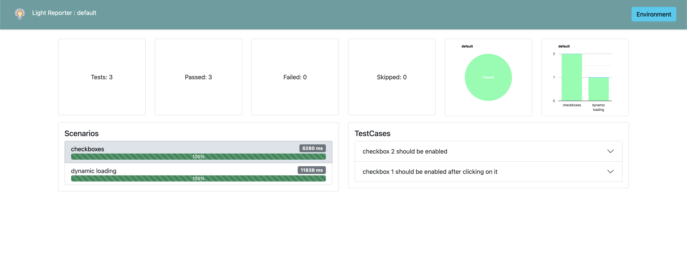
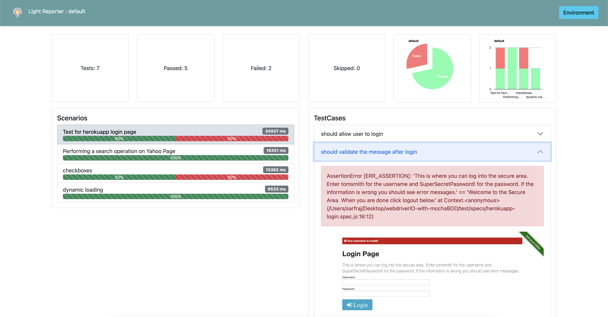
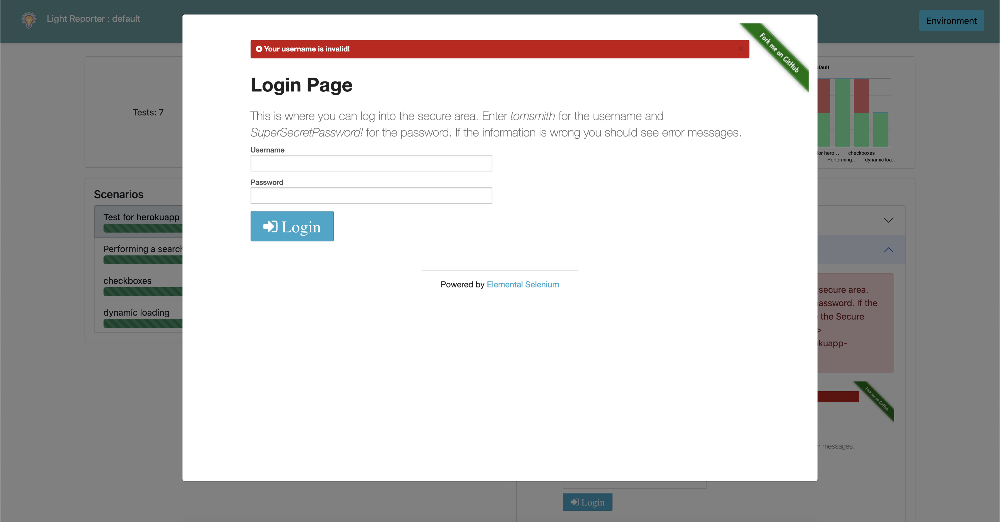

# WDIO-LIGHT-REPORTER

## Inspired by HTML and Mochawesome reporter

!Philosphy:

> This reporter does not support cucumber Report regeneration and is developed keeping in mind the bdd an mocha framework.
> Here,`describe()` section is considered as test scenario and `it()` as testcase inside the test scenarios.

## FEATURES

1. Easy setup
2. Enhanced UI
3. Screenshot embedded in html report
4. addLabel() to include steps context or name

## EXAMPLES





## Installation

NPM

```sh
npm install wdio-light-reporter --save-dev
```

## Configuration

```
reporters: ['dot', ['light',{
      outputDir: './Results'
  }]
],
```

## Screenshots

The Reporter does not have capability to automatically configure to take screenshots but however if manually configured, it listen to the event and attach the screenshots in the HTML report.
**To include screenshots in the report add below code in the afterTest() hook in the wdio conf file.**

```
afterTest: async function (test,context,{ error, result, duration, passed, retries }) {
    if (!passed) {await browser.takeScreenshot()}
},
```

## ResultFiles

Each run regenerates json report for each spec files, to generate combined json and HTML report, add below code in the **onComplete()** hook in wdio conf file

```
 onComplete: function (exitCode, config, capabilities, results) {
    const mergeResults = require("wdio-light-reporter/src/mergeResults"); //you can add this on top of the file
    mergeResults("./Results", process.argv);
 },
```

> If you run your test wihout any --suite option then it considers default as the suite
> Reporter does not works if you give multiple parameters as suites while run.
> wdio run `wdio.conf.js --suite firstSuite` - **(WOKRS FINE)** :)  
>  wdio run `wdio.conf.js --suite firstSuite --suite secondSuite` **(DOES NOT WORK)** :(

## Adding Context

> You can use `useLabel()` to add context to any steps or added to include it as steps.

```
const { addLabel } = require("wdio-light-reporter").default;
describe("Show how to use addLabel ", () => {
  it("report will added this a steps/context in report", async () => {
      addLabel("Log Example 1 as step 1")
      console.log("Log Example 1 )
      addLabel("Log Example 2 as step 2")
      console.log("Log Example 2 )
  })
})


```

## License

MIT
**Free, Hell Yeah!**
